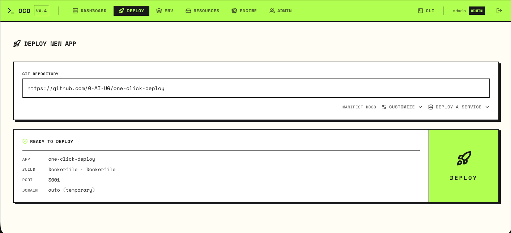

<div align="center">

# One-Click Deploy

**Self-hosted PaaS for Hetzner Cloud. Git repo in, live HTTPS app out.**

No Kubernetes. No YAML. Just your Hetzner account.

[](LICENSE)
[](https://github.com/0-AI-UG/one-click-deploy/pkgs/container/one-click-deploy)
[](https://github.com/0-AI-UG/one-click-deploy)



</div>

---

A lightweight, self-hostable alternative to Heroku, Railway, and Render, built exclusively for [Hetzner Cloud](https://www.hetzner.com/cloud). Point it at a Git repo and your Hetzner account, and it provisions the server, builds your container, configures DNS, issues TLS, and serves traffic. One provider, deeply integrated: Hetzner servers, volumes, private networks, firewalls, and DNS.

## Quick Start

You'll need a [Hetzner Cloud API token](https://docs.hetzner.cloud/#getting-started) (Read & Write) from your project's **Security → API Tokens**.

```bash
docker run --rm \
  -e OCD_AUTO_DEPLOY='{"provider_token":"<hetzner_token>","domain":"panel.example.com"}' \
  ghcr.io/0-ai-ug/one-click-deploy:latest
```

Bootstrap provisions the server and prints its IP. Open `https://<domain>` and create your admin account. That's it.

### DNS

The panel needs `<domain>` to resolve to the new server so Let's Encrypt can issue a TLS certificate. You have two options:

- **Automatic** — add `"dns_zone_id":"<zone_id>"` to the config and the A record is created for you. Find the zone ID in the [Hetzner DNS Console](https://dns.hetzner.com) → your zone → the ID in the URL (`dns.hetzner.com/zone/<zone_id>`).
- **Manual** — leave `dns_zone_id` out and create an `A` record for `<domain>` → the server IP printed at the end of bootstrap. TLS is issued automatically once DNS propagates.

> **No domain?** Omit `domain` entirely. Bootstrap derives a `<server-ip>.nip.io` domain once the server exists and serves it with a self-signed certificate — no DNS setup and no real domain needed (your browser will warn on first visit). Just:
> ```bash
> docker run --rm \
>   -e OCD_AUTO_DEPLOY='{"provider_token":"<hetzner_token>"}' \
>   ghcr.io/0-ai-ug/one-click-deploy:latest
> ```

Prefer bash? Copy `example.panel.json` to `panel.json` and run `./scripts/bootstrap.sh`.

## Features

- Deploy from any Git repo (Dockerfile or auto-detected via [Railpack](https://railpack.io))
- Auto-provisioned Hetzner Cloud servers, volumes, private networks, and firewalls
- Auto TLS (Caddy + Let's Encrypt) and auto DNS via Hetzner DNS
- Horizontal scaling, auto-scaling, pause/resume
- Managed services: Postgres, Redis, MySQL, and more
- Web terminal, log streaming, rollbacks, webhooks
- Passkeys, TOTP, GitHub OAuth, multi-user RBAC
- `ocd` CLI for Linux, macOS, Windows
- Self-managing: the panel deploys itself

## CLI

```bash
ocd login https://panel.example.com
ocd deploy
ocd logs my-app --tail=200
ocd ssh my-app -i
```

## Development

```bash
bun install
bun run dev          # panel on :3001
bun run test
bun run build:cli
```

Built with [Bun](https://bun.sh), TypeScript, React, SQLite, and [Caddy](https://caddyserver.com).

## Links

- [Contributing](CONTRIBUTING.md)
- [Issues](https://github.com/0-AI-UG/one-click-deploy/issues) · [Discussions](https://github.com/0-AI-UG/one-click-deploy/discussions)
- [MIT License](LICENSE)
